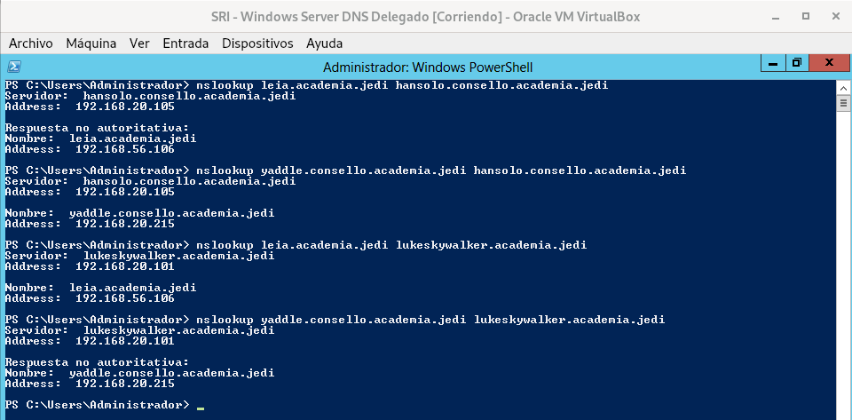

# 1.5 Subdominios
### 1. Instala no equipo lukeskywalker un subdominio chamado "mestre", e dentro del os rexistros 
- A, kitfisto 192.168.20.212 
- A, macewindu 192.168.20.213.
### Captura as zonas, e un cliente resolvendo un rexistro A do dominio e do subdominio contra lukeskywalker

### 2. Instala no equipo hansolo (Windows 2012) un subdominio delegado de "academia.jedi" chamado consello. . Engade nel os rexistros:
- A, yaddle 192.168.20.215
- A, yaraelpoof 192.168.20.216
### Captura as dúas zonas, e un cliente resolvendo un rexistro  A do dominio e do subdominio contra hansolo e lukeskywalker

### 3. Instala no equipo darthvader un subdominio chamado antigarepublica, e nel os rexistros:
- A, xendor 192.168.20.222
- A, ardenlyn 192.168.20.223.
### Captura as dúas zonas, e un cliente resolvendo un rexistro  A do dominio e do subdominio contra darthvader

### 4. Instala no equipo leia (Debian/Ubuntu Server) un subdominio delegado de "starwars.lan" chamado imperio. Engade nel os rexistros:
- A, tsuichoi 192.168.20.225
- A, bultarswan 192.168.20.226.
### Captura as dúas zonas, e un cliente resolvendo un rexistro  A do dominio e do subdominio contra leia e darthvader

