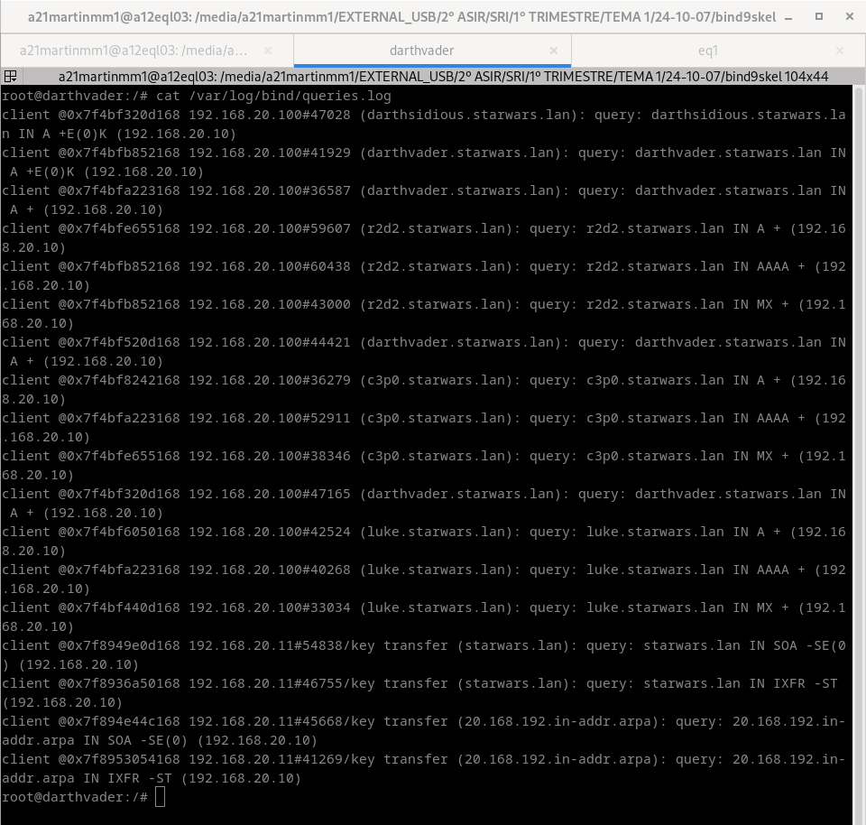
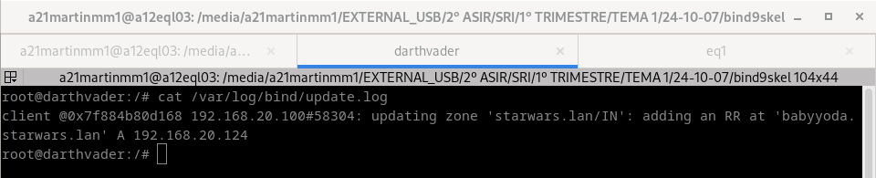
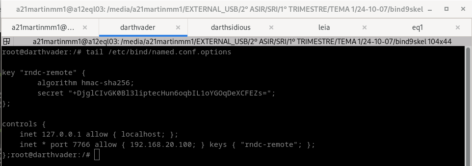
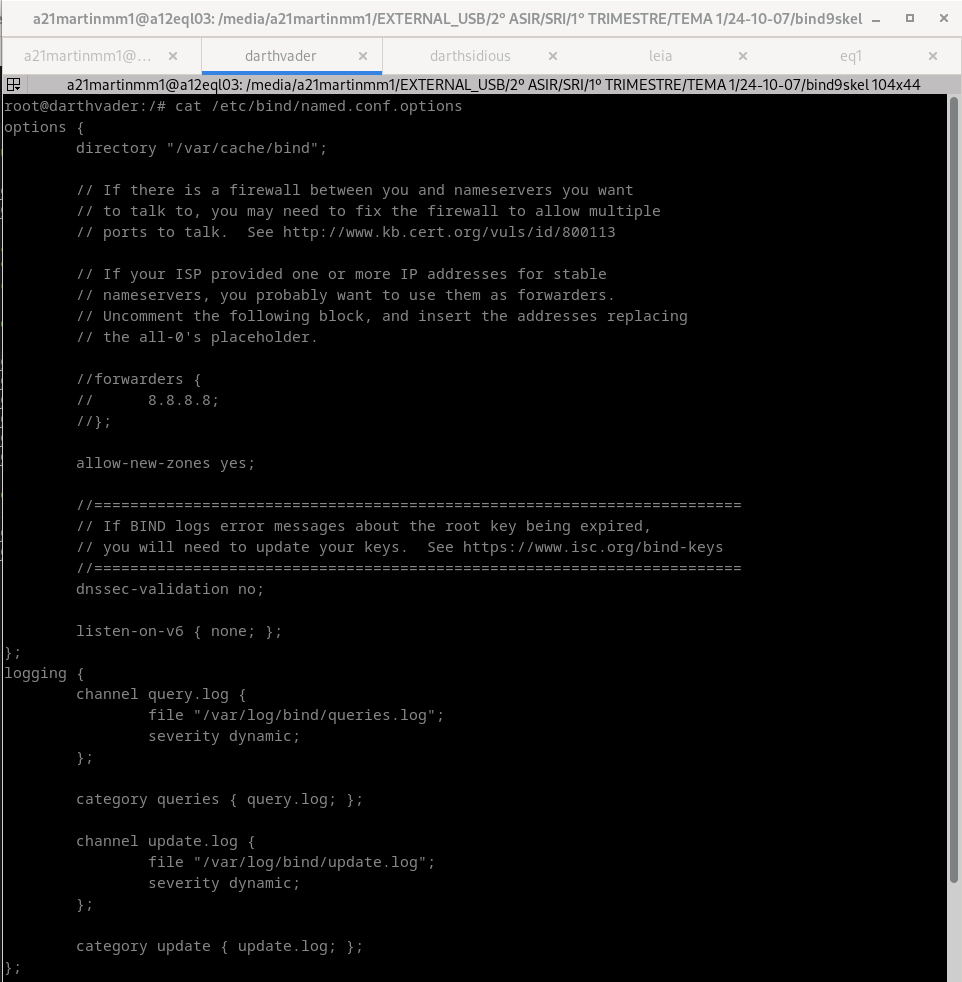
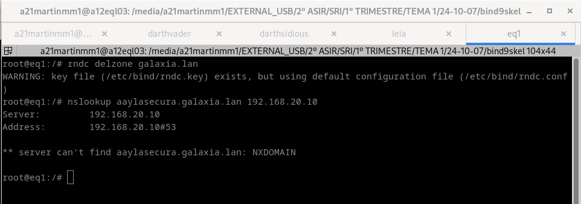

# 1.6 logs + utilidade rndc + nsupdate
### 1. Fai que no equipo darthvader se faga un log de todas as consultas (/var/log/bind/queries.log) e de todas as actualizacions (/var/log/bind/update.log) a dous ficheiros de log diferentes. Captura a configuración. Amosa as capturas dos dous ficheiros de log, despois de facer consultas e actualizacións e transferencias de zona.

### 2. Investiga como co comando "dig" podes pedir unha copia dunha zona.

### 3. Permite que o equipo darthvader poida ser controlado coa utilidade rndc desde un cliente ubuntu ou debian. Fai unha captura do servidor reiniciandose.

### 4. Instala unha zona dinámica no servidor darthvader chamada galaxia.lan e introduce os rexistros aaylasecura (192.168.20.239) e yarua (192.168.20.238). Esta zona debe ser cargada mediante rndc, e o servidor reiniciado con rndc. Proba tamén a eliminala con rndc. Inclue capturas do resultado dos comandos, comprobando tamén que se poden facer consultas.

### 5. Mediante a utilidade nsupdate, engade un rexistro chamado darthmaul (192.168.20.144) á zona starwars.lan empregando chaves

